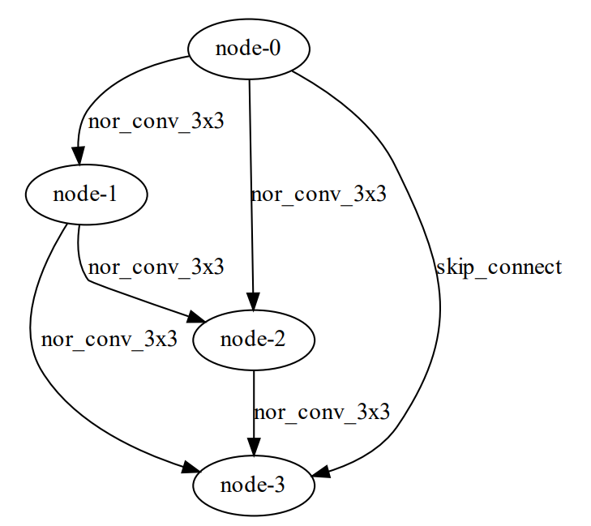
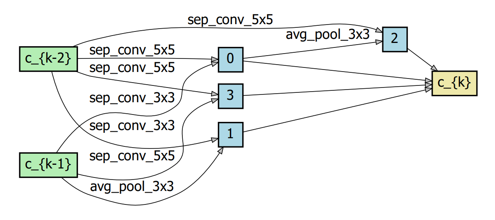

## Introduction

Code for paper: **Neural Architecture Search with Representation Mutual Information**

RMI-NAS is an efficient architecture search method based on Representation Mutual Information (RMI) theory. It aims at improving the speed of performance evaluation by ranking architectures with RMI, which is an accurate and effective indicator to facilitate NAS. RMI-NAS uses only one batch of data to complete training and generalizes well to different search spaces. For more details, please refer to our paper.


## Usage

### Installation

```bash
git clone https://git.openi.org.cn/PCL_AutoML/XNAS
cd XNAS
# set root path
export PYTHONPATH=$PYTHONPATH:/Path/to/XNAS
```

File [`NAS-Bench-201-v1_0-e61699.pth`](https://drive.google.com/open?id=1SKW0Cu0u8-gb18zDpaAGi0f74UdXeGKs) is needed for a previous version of `NAS-Bench-201` we are using. It should be downloaded and put into the `utils` directory.

#### Search

```bash
# download weight files for teacher models
./search/RMINAS/download_weight.sh
# NAS-Bench-201 + CIFAR-10
python search/RMINAS/RMINAS_nb201.py --cfg configs/search/RMINAS/nb201_cifar10.yaml
# NAS-Bench-201 + CIFAR-100
python search/RMINAS/RMINAS_nb201.py --cfg configs/search/RMINAS/nb201_cifar100.yaml
# NAS-Bench-201 + ImageNet
python search/RMINAS/RMINAS_nb201.py --cfg configs/search/RMINAS/nb201_imagenet16.yaml
# DARTS + CIFAR-10
python search/RMINAS/RMINAS_darts.py --cfg configs/search/RMINAS/darts_cifar10.yaml
# DARTS + CIFAR-100
python search/RMINAS/RMINAS_darts.py --cfg configs/search/RMINAS/darts_cifar100.yaml
# DARTS + ImageNet
python search/RMINAS/RMINAS_darts.py --cfg configs/search/RMINAS/darts_imagenet.yaml
```

## Results

### Results on NAS-Bench-201

| Method      | Search Cost<br />(seconds) | CIFAR-10 <br />Test Acc.(%) | CIFAR-100 <br />Test Acc.(%) | ImageNet16-120 <br />Test Acc.(%) |
| ----------- | -------------------------- | --------------------------- | ---------------------------- | --------------------------------- |
| RL          | 27870.7                    | 93.85±0.37                  | 71.71±1.09                   | 45.24±1.18                        |
| DARTS-V2    | 35781.8                    | 54.30±0.00                  | 15.61±0.00                   | 16.32±0.00                        |
| GDAS        | 31609.8                    | 93.61±0.09                  | 70.70±0.30                   | 41.71±0.98                        |
| FairNAS     | 9845.0                     | 93.23±0.18                  | 71.00±1.46                   | 42.19±0.31                        |
| **RMI-NAS** | **1258.2**                 | **94.28±0.10**              | **73.36±0.19**               | **46.34±0.00**                    |


### Results on DARTS

| Method      | Search Cost<br />(gpu-days) | CIFAR-10 <br />Test Acc.(%)<br />(paper) | CIFAR-10 <br />Test Acc.(%)<br />(retrain) |
| ----------- |-----------------------------| ---------------------------------------- | ------------------------------------------ |
| AmoebaNet-B | 3150                        | 2.55±0.05                                | -                                          |
| NASNet-A    | 1800                        | 2.65                                     | -                                          |
| DARTS (1st) | 0.4                         | 3.00±0.14                                | 2.75                                       |
| DARTS (2nd) | 1                           | 2.76±0.09                                | 2.60                                       |
| SNAS        | 1.5                         | 2.85±0.02                                | 2.68                                       |
| PC-DARTS    | 1                           | 2.57±0.07                                | 2.71±0.11                                  |
| FairDARTS-D | 0.4                         | 2.54±0.05                                | 2.71                                       |
| **RMI-NAS** | **0.08**                    | -                                        | 2.64±0.04                                  |

Comparisons with other methods in DARTS. We also report retrained results under exactly the same settings to ensure a fair comparison. Our method delivers a comparable accuracy but substantial improvements on time comsumption.

#### Normal cell


#### Reduce cell
